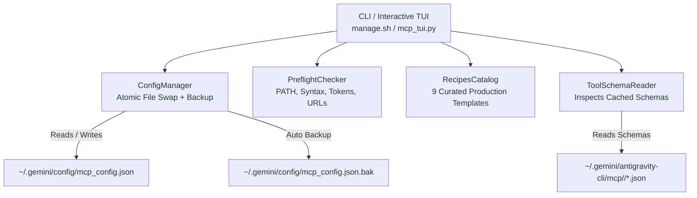

# Antigravity (AGY) MCP Server Manager & Interactive TUI Configurator

A zero-dependency terminal UI form editor, diagnostics suite, and CLI manager for configuring Model Context Protocol (MCP) servers in Google Antigravity (`~/.gemini/config/mcp_config.json`).

---

## Table of Contents
- [Why an Interactive TUI Configurator?](#why-an-interactive-tui-configurator)
- [Quick Start](#quick-start)
- [Architecture & System Overview](#architecture--system-overview)
- [Dashboard & Keyboard Navigation Map](#dashboard--keyboard-navigation-map)
- [Form Editor: Multi-Tab Guide](#form-editor-multi-tab-guide)
- [Deep Dive: Native Antigravity Capabilities](#deep-dive-native-antigravity-capabilities)
  - [1. Google Application Default Credentials (ADC)](#1-google-application-default-credentials-adc)
  - [2. OAuth 2.0 Client Authentication](#2-oauth-20-client-authentication)
  - [3. Lazy Tool Loading vs. Context Bloat](#3-lazy-tool-loading-vs-context-bloat)
  - [4. Background Tool Execution](#4-background-tool-execution)
  - [5. Sandbox Bypass & Isolation Control](#5-sandbox-bypass--isolation-control)
  - [6. Tool Namespacing & Prefix Control](#6-tool-namespacing--prefix-control)
- [Curated Recipes Catalog](#curated-recipes-catalog)
- [Discovered Tool Inspector](#discovered-tool-inspector)
- [Non-Interactive & Scriptable CLI](#non-interactive--scriptable-cli)
- [Atomic Persistence & Backup Safety](#atomic-persistence--backup-safety)

---

## Why an Interactive TUI Configurator?

Configuring MCP servers manually by editing `~/.gemini/config/mcp_config.json` is prone to several common failure modes:
1. **Quoting and Escaping Bugs**: Command arguments containing flags, URLs, file paths, or JSON payloads frequently break when escaping nested strings inside raw JSON arrays.
2. **Missing Executables in `$PATH`**: A typo in `npx`, `uvx`, `python3`, or a binary name is not caught until the language server attempts to spawn the child process, often failing silently.
3. **Hidden Native AGY Features**: Many developers are unaware of powerful native Antigravity settings such as `authProviderType: "google_credentials"`, OAuth 2.0 credentials, background task routing, or lazy tool caching.
4. **Prompt Token Exhaustion**: In standard MCP configurations, servers may inject dozens of tool schemas into the model prompt on every turn. Without lazy tool loading, context windows quickly fill with unused JSON schema definitions.

The **AGY MCP Server Manager** provides:
- A full-screen keyboard-navigable form editor with inline validation.
- Live `$PATH` binary resolution checks.
- One-click application of 9 curated, battle-tested MCP server templates.
- Secret masking (`●●●●`) to protect tokens and API keys during screen shares.
- Full inspection of discovered tool schemas cached on disk.
- Preflight diagnostics and colored JSON preview before saving.
- Atomic configuration persistence with automated `.bak` backups.

---

## Quick Start

Launch the interactive terminal UI from your workspace:

```bash
chmod +x CLI/mcp/manage.sh
./CLI/mcp/manage.sh
```

Or run directly via Python 3 (requires standard library only):

```bash
python3 CLI/mcp/mcp_tui.py
```
### Scriptable CLI Commands

```bash
# List all configured servers, enabled state, transport, and tool counts:
./CLI/mcp/manage.sh --list

# Output server list as machine-readable JSON (secrets redacted by default):
./CLI/mcp/manage.sh --list --json

# Emit unredacted secrets in JSON output (do NOT use in CI or shared logs):
./CLI/mcp/manage.sh --list --json --show-secrets

# Use custom configuration file or environment override:
./CLI/mcp/manage.sh --config /path/to/mcp_config.json --list
export AGY_MCP_CONFIG="/path/to/mcp_config.json"

# Dry run mutations without writing to disk:
./CLI/mcp/manage.sh --enable chrome-devtools-mcp --dry-run
./CLI/mcp/manage.sh --enable chrome-devtools-mcp --dry-run --show-secrets

# Enable or disable a server without launching the UI:
./CLI/mcp/manage.sh --enable chrome-devtools-mcp
./CLI/mcp/manage.sh --disable chrome-devtools-mcp

# Safely remove a server (creates timestamped backup in mcp_config.json.bak.<timestamp>):
./CLI/mcp/manage.sh --remove obsolete-server

# View CLI options:
./CLI/mcp/manage.sh --help
```

---

## Architecture & System Overview



---

## Dashboard & Keyboard Navigation Map

When you launch `./manage.sh`, you are presented with the **Dashboard View**:

```
 ANTIGRAVITY (AGY) MCP SERVER MANAGER 
 Config: /home/user/.gemini/config/mcp_config.json  | Total Servers: 2
─────────────────────────────────────────────────────────────────────────────────────────────────────────────
 STATUS    SERVER NAME             TRANSPORT  COMMAND / URL                       TOOLS    AUTH            
─────────────────────────────────────────────────────────────────────────────────────────────────────────────
 [●] ON    chrome-devtools-mcp     stdio      npx -y chrome-devtools-mcp@latest   29 tools none            
 [○] OFF   google-developer-know.. http       https://developerknowledge.googl..   3 tools Google ADC      
─────────────────────────────────────────────────────────────────────────────────────────────────────────────
 [Space] Toggle  [e/Enter] Edit  [a] Add  [t] Recipes  [v] Tools  [d] Delete  [q] Quit
```

### Keyboard Shortcuts

| Context | Key | Action |
| :--- | :--- | :--- |
| **Dashboard** | `↑` / `↓` or `k` / `j` / `[Tab]` | Select server in the table (with cyan `❯ ` pointer) |
| **Dashboard** | `[Space]` | Toggle server ON (`[●] ON`) / OFF (`[○] OFF`) |
| **Dashboard** | `[Enter]` / `[e]` | Open Form Editor for selected server |
| **Dashboard** | `[a]` | Add a new blank MCP server |
| **Dashboard** | `[t]` | Open Curated Recipes Catalog |
| **Dashboard** | `[v]` | View discovered cached tools & parameters |
| **Dashboard** | `[d]` | Delete selected server (with confirmation dialog) |
| **Dashboard** | `[q]` | Exit manager |
| **Form Editor** | `[1]` - `[5]` | Jump directly to Tab 1–5 |
| **Form Editor** | `[Tab]` / `[Shift-Tab]` | Cycle forward/backward through tabs |
| **Form Editor** | `↑` / `↓` | Move selection between fields / table rows |
| **Form Editor** | `[Enter]` / `[Space]` | Start inline editing or toggle checkbox |
| **Form Editor** | `[s]` | Save configuration (runs Preflight first) |
| **Form Editor** | `[Esc]` | Discard changes and return to Dashboard |
| **Tab 2 (Env/Headers)** | `[m]` | Toggle secret masking (`●●●●` vs plaintext) |
| **Recipes View** | `↑` / `↓` or `k` / `j` | Select recipe in the catalog |
| **Recipes View** | `[Enter]` | Load selected recipe into Form Editor |
| **Recipes View** | `[Esc]` / `[q]` | Return to Dashboard |
| **Tools Viewer** | `↑` / `↓` or `k` / `j` / `PgUp` / `PgDn` | Scroll through cached tool descriptions |

---

## Form Editor: Multi-Tab Guide

The Form Editor isolates server configuration into five logical tabs:

### Tab 1: General & Command
- **Server Name**: Unique identifier (alphanumeric, `-`, `_`).
- **Transport Mechanism**: `stdio` (local command-line executable) or `http` (remote HTTP / SSE service).
- **Executable Command** *(stdio)*: Binary to execute (`npx`, `uvx`, `python3`, `docker`). Displays a live `[✓ In PATH]` or `[✗ Not in $PATH]` badge.
- **Command Arguments** *(stdio)*: Space-separated arguments. Safely tokenized with `shlex.split`.
- **Server URL** *(http)*: Remote endpoint starting with `http://` or `https://`.
- **Timeout (Seconds)**: Execution timeout (default: `60s`).
- **Bypass Sandbox**: Enable to bypass AGY's process and filesystem sandbox.
- **Skip Name Prefix**: Expose tools without the `mcp_<server>_` prefix.
- **Server State**: Toggle between `ENABLED` and `DISABLED`.

### Tab 2: Environment Variables & Headers
- Dynamic key-value table editor.
- In `stdio` mode: configures `env: { "KEY": "VALUE" }`.
- In `http` mode: configures `headers: { "Header": "Value" }`.
- Hotkey **`[m]`**: Toggles secret masking to prevent token exposure in screen shares or pairing sessions.
- Edit keys, edit values, delete rows, or select `[+ Add Item]` to append entries.

### Tab 3: Authentication
- **Provider Type**:
  - `none`: No specialized authentication header required.
  - `google_credentials`: Uses Google Application Default Credentials (ADC).
  - `oauth`: Full OAuth 2.0 Client credentials flow.
- When `oauth` is selected, fields for **OAuth Client ID** and **OAuth Client Secret** are exposed.

### Tab 4: Tooling & Context Optimization
- **Lazy Tool Loading** (`toolConfig: { eager: false }`): Recommended. Caches schemas on disk and only requests tools when needed. Saves up to 80% prompt context tokens.
- **Background Execution** (`toolConfig: { background: "ALWAYS" }`): Asynchronously runs long-running tools without blocking the agent.
- **Tool Namespacing** (`skipToolNamePrefix`): Cleanly namespace or un-namespace tools.

### Tab 5: Preflight Diagnostics & JSON Preview
- Executes real-time validation checks:
  - `[✓ PASS]` Valid identifier syntax.
  - `[✓ PASS]` / `[✗ FAIL]` Executable presence in `$PATH` or HTTP endpoint validation.
  - `[ℹ INFO]` Notes regarding ADC or background execution.
  - `[⚠ WARN]` Unreplaced placeholder values or eager tool context bloat.
- Formatted, syntax-highlighted JSON preview of the exact payload that will be written to `mcp_config.json`.
- Press **`[Enter]`** or **`[s]`** to commit and save.

---

## Deep Dive: Native Antigravity Capabilities

### 1. Google Application Default Credentials (ADC)

When configuring Google Cloud, Google Workspace, or internal Developer APIs (e.g., Google Developer Knowledge corpus):

```json
{
  "google-developer-knowledge": {
    "authProviderType": "google_credentials",
    "serverUrl": "https://developerknowledge.googleapis.com/mcp"
  }
}
```

Antigravity intercepts outbound HTTP requests to this endpoint, automatically acquires an OAuth2 access token via the local ADC credential chain (`gcloud auth application-default print-access-token` or service account metadata), and attaches the `Authorization: Bearer <token>` header without requiring manual token refresh logic.

---

### 2. OAuth 2.0 Client Authentication

For remote enterprise MCP services supporting OAuth 2.0:

```json
{
  "enterprise-service": {
    "authProviderType": "oauth",
    "oauth": {
      "clientId": "your-client-id.apps.googleusercontent.com",
      "clientSecret": "your-client-secret"
    },
    "serverUrl": "https://mcp.internal.corp/sse"
  }
}
```

AGY manages client credential exchange and token caching automatically. Legacy flat keys (`oauthClientId`, `oauthClientSecret`) are automatically recognized, migrated, and persisted to the conforming schema.

---

### 3. Lazy Tool Loading vs. Context Bloat

By default, an MCP server exposing 30 tools injects 30 complete JSON schema definitions into the agent's system prompt on **every single turn**. For servers like `chrome-devtools-mcp` (30 tools) or `github` (25+ tools), this consumes 4,000–8,000 tokens per prompt before any code is even processed.

Antigravity supports **Lazy Tool Loading**:

```json
{
  "chrome-devtools-mcp": {
    "command": "npx",
    "args": ["-y", "chrome-devtools-mcp@latest"],
    "toolConfig": {
      "eager": false
    }
  }
}
```

- **Eager (`eager: true`)**: Tool schemas are rendered in full in the system prompt.
- **Lazy (`eager: false`, Default in TUI)**: AGY caches schemas in `~/.gemini/antigravity-cli/mcp/<server>/*.json`. Only tool names are registered, and full schemas are inspected dynamically when the agent determines they are relevant.

---

### 4. Background Tool Execution

For long-running tasks such as large database dumps, browser navigations, or test executions:

```json
{
  "puppeteer": {
    "command": "npx",
    "args": ["-y", "@modelcontextprotocol/server-puppeteer"],
    "toolConfig": {
      "background": "ALWAYS"
    }
  }
}
```

When set to `ALWAYS`, tool calls are dispatched to background worker tasks, allowing the agent to continue processing turns or report partial progress without stalling.

---

### 5. Sandbox Bypass & Isolation Control

Antigravity runs local process MCP servers in a sandboxed runtime environment by default. If a server requires unfettered root, Docker daemon, or host network access:

```json
{
  "docker-mcp": {
    "command": "docker",
    "args": ["run", "-i", "--rm", "mcp/docker"],
    "bypassSandbox": true
  }
}
```

The TUI flags `bypassSandbox` with a clear security diagnostic warning.

---

### 6. Tool Namespacing & Prefix Control

By default, AGY prefixes MCP tools with the server name to avoid collisions:
`mcp_google-developer-knowledge_answer_query`

To expose tools directly under their raw function name (e.g. `answer_query`):

```json
{
  "google-developer-knowledge": {
    "skipToolNamePrefix": true,
    "serverUrl": "https://developerknowledge.googleapis.com/mcp"
  }
}
```

---

## Curated Recipes Catalog

Press **`[t]`** in the Dashboard to access ready-to-run templates:

| Recipe | Transport | Badge | Command / Endpoint | Description |
| :--- | :--- | :--- | :--- | :--- |
| **GitHub** | `stdio` | `npx` | `@modelcontextprotocol/server-github` | Inspect repos, PRs, code search, and file issues. |
| **Google Developer Knowledge**| `http` | `ADC` | `https://developerknowledge.googleapis.com/mcp` | Official Google Developer Knowledge corpus via ADC. |
| **Local Filesystem** | `stdio` | `npx` | `@modelcontextprotocol/server-filesystem` | Secure file access for the current workspace. |
| **PostgreSQL** | `stdio` | `npx` | `@modelcontextprotocol/server-postgres` | Read-only SQL queries and schema introspection. |
| **SQLite** | `stdio` | `uvx` | `mcp-server-sqlite` | Local SQLite database exploration via `uvx`. |
| **Puppeteer Browser** | `stdio` | `npx` | `@modelcontextprotocol/server-puppeteer` | Headless browser automation and scraping. |
| **Chrome DevTools** | `stdio` | `npx` | `chrome-devtools-mcp@latest` | DevTools protocol, snapshots, and performance. |
| **Knowledge Graph Memory** | `stdio` | `npx` | `@modelcontextprotocol/server-memory` | Persistent entity/relation memory across sessions. |
| **HTTP Fetch** | `stdio` | `uvx` | `mcp-server-fetch` | Fast web fetching and HTML-to-markdown extraction. |

Selecting any recipe opens the Form Editor with all parameters pre-populated for customization before saving.

> [!CAUTION]
> **Third-Party Package Execution Security (`npx`, `uvx`)**
> Recipes utilizing `npx -y` or `uvx` dynamically download and execute external packages from the public npm and PyPI registries. In sensitive or production environments, always audit package provenance, verify binary integrity, and pin exact package versions (e.g. `chrome-devtools-mcp@0.5.2` rather than `@latest`) to guard against supply chain vulnerabilities.

---

## Discovered Tool Inspector

Press **`[v]`** on any server in the Dashboard to browse the discovered tools cached by AGY under:
`~/.gemini/antigravity-cli/mcp/<server_name>/*.json`

The viewer displays:
- Tool names and parameter signatures (required vs optional).
- Parameter type summaries (`query*: string`, `limit: integer`).
- Complete documentation descriptions.
- Scrollable with `↑`, `↓`, `PgUp`, `PgDn`.

---

## Non-Interactive & Scriptable CLI

The manager is fully scriptable in CI/CD pipelines, shell scripts, or dotfile setup routines:

```bash
# Print formatted server table:
./manage.sh --list

# Output server list as machine-readable JSON (secrets redacted by default):
./manage.sh --list --json

# Emit unredacted secrets in JSON (use with caution; avoid in shared terminal logs or CI):
./manage.sh --list --json --show-secrets

# Use custom configuration file or environment override:
./manage.sh --config /path/to/mcp_config.json --list
export AGY_MCP_CONFIG="/path/to/mcp_config.json"

# Dry run mutations without writing to disk:
./manage.sh --enable chrome-devtools-mcp --dry-run
./manage.sh --enable chrome-devtools-mcp --dry-run --show-secrets
./manage.sh --disable chrome-devtools-mcp --dry-run
./manage.sh --remove obsolete-server --dry-run

# Enable or disable a server:
./manage.sh --enable chrome-devtools-mcp
./manage.sh --disable chrome-devtools-mcp

# Delete a server:
./manage.sh --remove obsolete-server

# Direct python invocation:
python3 CLI/mcp/mcp_tui.py --list
```

Exit codes:
- `0`: Success
- `1`: Validation error, missing argument, or server not found
- `2`: Configuration syntax or unparseable JSON error (`ConfigParseError`)

---

## Atomic Persistence & Backup Safety

All mutations to `~/.gemini/config/mcp_config.json` adhere to strict safety guarantees:
1. **Multi-Version Timestamped Backups**: Before writing any change, a microsecond-timestamped backup (`mcp_config.json.bak.<YYYYMMDD_HHMMSS_ffffff>`) is created, and `mcp_config.json.bak` is updated. Both backup files are explicitly restricted to mode `0o600` via `os.chmod`. A rolling retention policy automatically maintains the 5 most recent backups. If backup creation fails, the mutation is aborted immediately to protect existing data.
2. **Atomic Temp File Replacement & Fsync**: Data is written via `tempfile.mkstemp` with `0o600` permissions, flushed, `os.fsync`ed to disk, atomically swapped via `os.replace`, and the parent directory is fsynced.
3. **Strict Permissions**: The configuration directory permissions are verified and tightened to `0o700` if looser permissions exist, and configuration and backup files are created with `0o600` to prevent token leakage across local users.
4. **Symlink Preservation**: Resolves symbolic links (`os.path.realpath`) so configurations managed in dotfile repositories are safely updated in-place without replacing the symlink with a regular file.
5. **Process Concurrency Locking**: Serializes concurrent reads and writes with a re-entrant `_config_lock` context manager utilizing `fcntl.flock` on `.mcp_config.lock` (opened with `O_NOFOLLOW | O_CREAT | O_RDWR` with mode `0o600`) to prevent race conditions or partial writes from concurrent CLI invocations.
6. **Key & Comment Preservation**: All unmodeled AGY or third-party server keys (`cwd`, `description`, `trust`, etc.) are captured under `extra` and round-tripped losslessly.
7. **Parse Protection**: Unparseable or corrupt configuration files are never overwritten. A typed `ConfigParseError` is raised with file path, line, and column diagnostics.
